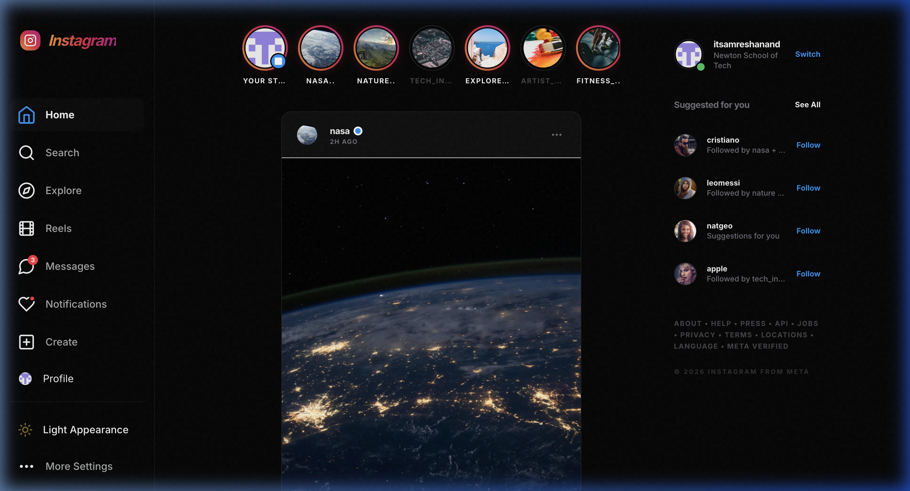
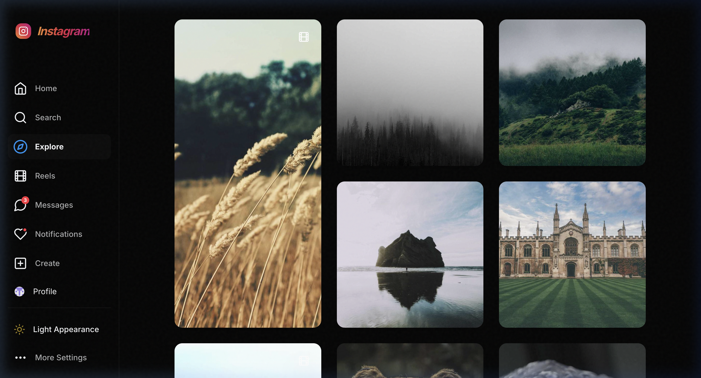
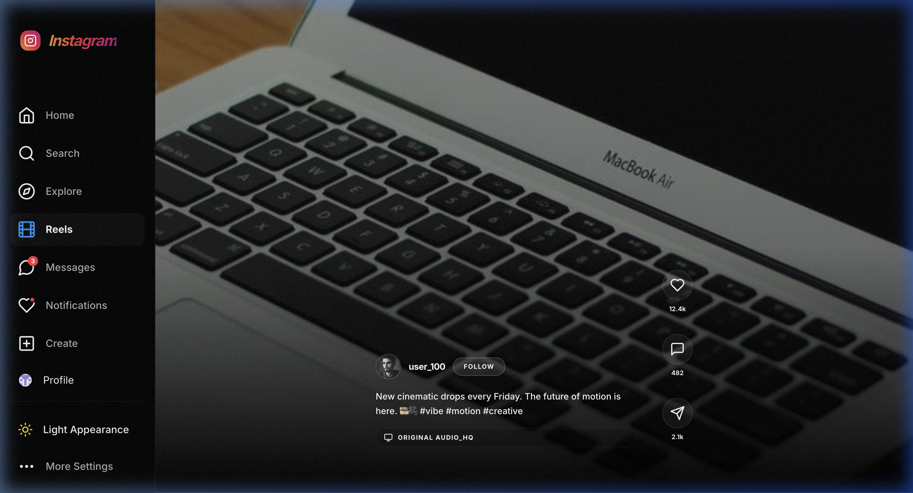
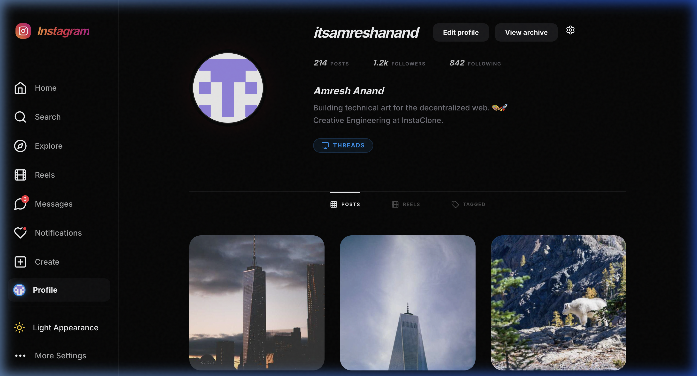

# ✨ Instagram Elite: A Cinematic Experience 📸

A high-fidelity, ultra-premium Instagram ecosystem built with **React 18**, **Framer Motion**, and **Tailwind CSS**. This project transcends a simple clone, offering a cinematic interface with advanced glassmorphism, noise textures, and professional content management.

---

## 💎 Visual Excellence

| Home Feed | Explore Masonry |
|-----------|-----------------|
|  |  |

| Immersive Reels | Professional Profile |
|-----------------|----------------------|
|  |  |

---

## 🌟 Key Features

### 🎬 Cinematic UI/UX
- **Immersive Stories**: Full-screen story viewer with progress tracking, motion transitions, and interactive replies.
- **Glassmorphism 2.0**: Advanced backdrop blurs and translucent layers for a premium, high-end feel.
- **Noise Texture Overlays**: Subtle digital grain applied globally for a tactile, cinematic aesthetic.
- **Framer Motion**: Smooth entry animations, micro-interactions, and page-switching transitions.

### 🌗 Pro Theme Engine
- **Dark Mode First**: Engineered for high-contrast dark environments with vibrant brand-accent support.
- **Seamless Switching**: Instant transition between Dark and Light appearances across the entire technical stack.

### 🧭 Navigation & Content
- **Home Feed**: Technical aspect-ratio management (4:5 and 1:1) with high-resolution imagery and shimmer loading skeletons.
- **Explore Grid**: Intelligent masonry-style layout with depth-hover effects and staggered content spans.
- **Immersive Reels**: Vertical scroll-snap container with dedicated brand-gradient action bars and full-screen playback.
- **Pro Messaging**: Dual-pane messenger suite with thread previews and active-user trays.
- **Profile Hub**: Editorial-style header with technical brand badges and a tabbed navigation system (Posts, Reels, Tagged).

---

## 🛠️ Technology Stack

- **Framework**: [React 18](https://reactjs.org/)
- **Animation**: [Framer Motion](https://www.framer.com/motion/)
- **Styling**: [Tailwind CSS v3](https://tailwindcss.com/)
- **Icons**: [Lucide React](https://lucide.dev/)
- **Build Tool**: [Vite](https://vitejs.dev/)
- **Branding**: Official Instagram Brand Gradient support

---

## 🚀 Getting Started

### Prerequisites
- **Node.js**: v16.0 or higher
- **Package Manager**: npm or yarn

### Installation

1. **Clone the repository**:
   ```bash
   git clone https://github.com/amreshanand/Insta-clone.git
   ```

2. **Install dependencies**:
   ```bash
   npm install
   ```

3. **Launch the cinematic experience**:
   ```bash
   npm run dev
   ```

---

## 👤 Author

**Amresh Anand**  
*Creative Engineering | Newton School of Technology*

---

> [!IMPORTANT]
> **Project Note**: This application is a high-end UI/UX demonstration developed to showcase advanced React architecture, technical styling, and modern design principles.
